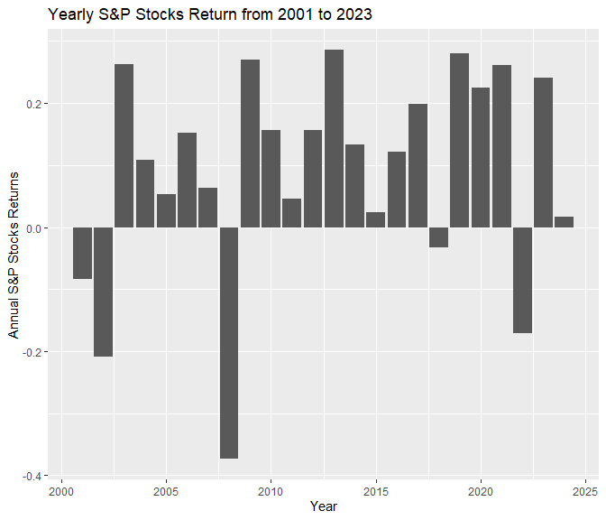

Week 2 lecture
================
Jessica Widyawati
2024-01-31

``` r
library(tidyverse)
```

    ## Warning: package 'tidyverse' was built under R version 4.3.2

    ## ── Attaching core tidyverse packages ──────────────────────── tidyverse 2.0.0 ──
    ## ✔ dplyr     1.1.2     ✔ readr     2.1.4
    ## ✔ forcats   1.0.0     ✔ stringr   1.5.0
    ## ✔ ggplot2   3.4.3     ✔ tibble    3.2.1
    ## ✔ lubridate 1.9.2     ✔ tidyr     1.3.0
    ## ✔ purrr     1.0.2     
    ## ── Conflicts ────────────────────────────────────────── tidyverse_conflicts() ──
    ## ✖ dplyr::filter() masks stats::filter()
    ## ✖ dplyr::lag()    masks stats::lag()
    ## ℹ Use the conflicted package (<http://conflicted.r-lib.org/>) to force all conflicts to become errors

``` r
library(lubridate)
```

\#read stocks data

``` r
stocks = readRDS("../data/wk2_stocks.rds")
```

``` r
#cumulative returns of the SP stocks
sum(stocks$SPY_returns)
```

    ## [1] 2.183304

``` r
#average daily returns of the SP index
sum(stocks$SPY_returns)/(sum(!duplicated(stocks$date)))
```

    ## [1] 0.0003765616

``` r
mean(stocks$SPY_returns)
```

    ## [1] 0.0003765616

``` r
#standard deviation
sd(stocks$SPY_returns)
```

    ## [1] 0.01221943

plots

``` r
#prices of SP
stocks %>% 
  ggplot(aes(x = date, y = SPY_prices)) +
  geom_line()
```

<!-- -->

``` r
#total yearly returns of SP from 2001 to 2023
stocks %>% 
  mutate(year = year(date))%>%
  group_by(year) %>%
  summarise(yearly_total = sum(SPY_returns)) %>%
  ggplot(aes(x= year, y = yearly_total)) +
  geom_line()
```

<!-- -->
